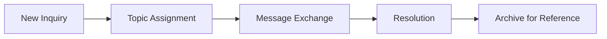

# Messaging System

The Messaging feature enables secure, organized communication between healthcare providers and patients through topic-based conversations.

## Overview

Messages are organized by conversation topics, allowing care teams to maintain clear, contextual communication with patients. Each conversation is linked to a specific patient for easy reference.

<Info>
All messages are HIPAA-compliant and encrypted for patient privacy.
</Info>

## Key Features

<CardGroup cols={2}>
  <Card title="Topic-Based Conversations" icon="comments">
    Organize messages by subject for clarity
  </Card>
  <Card title="Read/Unread Tracking" icon="envelope">
    Visual indicators for new messages
  </Card>
  <Card title="Patient Linking" icon="user">
    Quick access to patient profiles
  </Card>
  <Card title="Mobile Responsive" icon="mobile">
    Full functionality on all devices
  </Card>
</CardGroup>

## Statistics Dashboard

Four key metrics displayed at the top:

| Metric | Description |
|--------|-------------|
| Total Conversations | All conversations in the system |
| Unread Messages | Messages awaiting response |
| Unique Patients | Patients with active conversations |
| Total Messages | All messages sent |

## User Interface

### Sidebar Panel

The left panel displays the conversation list with:
- Patient avatar with initials
- Conversation topic
- Patient name (clickable to profile)
- Last message preview
- Unread indicator (pulsing dot)
- Message count and patient ID

### Chat Thread

The right panel shows the selected conversation:
- Header with patient info and profile button
- Message history with timestamps
- Sender identification (You/Patient)
- Message input with send button

### Mobile View

<Tabs>
  <Tab title="Conversation List">
    Full-width list view on mobile devices with touch-friendly interactions.
  </Tab>
  <Tab title="Chat View">
    Full-width chat thread with back button to return to list.
  </Tab>
</Tabs>

## Filtering Options

### Filter Tabs

| Tab | Description |
|-----|-------------|
| All | Show all conversations |
| Unread | Only conversations with new messages |
| Read | Conversations without unread messages |

### Search

Search conversations by:
- Topic name
- Patient name
- Patient ID

## Creating New Conversations

<Steps>
  <Step title="Click New Message">
    Click the "New Message" button in the header
  </Step>
  <Step title="Select Patient">
    Choose a patient from the dropdown list
  </Step>
  <Step title="Enter Topic">
    Provide a descriptive conversation topic
  </Step>
  <Step title="Write Message">
    Compose your initial message
  </Step>
  <Step title="Send">
    Click "Send Message" to create the conversation
  </Step>
</Steps>

## Conversation Features

### Message Display

- **Sender Identification**: Clear labels for You vs Patient
- **Timestamps**: Date and time for each message
- **Chronological Order**: Messages sorted by time
- **Auto-scroll**: Automatically scrolls to latest message

### Patient Quick Access

- Click patient name to view full profile
- Patient ID displayed for reference
- Profile button in chat header for quick navigation

## Workflow

1. **New Inquiry**: Patient or provider starts conversation
2. **Topic Assignment**: Descriptive topic provides context
3. **Message Exchange**: Back-and-forth communication
4. **Resolution**: Issue addressed or question answered
5. **Archive**: Conversation remains for future reference

## Integration Points

<AccordionGroup>
  <Accordion title="Patient Profile" icon="user">
    Access messages directly from the patient dashboard. View conversation history in context with other patient information.
  </Accordion>
  <Accordion title="Notifications" icon="bell">
    Unread message count visible in navigation sidebar. Badge updates in real-time as new messages arrive.
  </Accordion>
  <Accordion title="Care Team" icon="users">
    Shared visibility of patient conversations across the care team. Ensures continuity of care.
  </Accordion>
</AccordionGroup>

## Best Practices

<Check>
**Clear Topics**: Use descriptive topic names like "Post-Surgery Follow-up" or "Medication Questions"
</Check>

<Check>
**Timely Responses**: Monitor unread count regularly and respond within expected timeframes
</Check>

<Check>
**Patient Context**: Review patient profile when needed for informed responses
</Check>

<Check>
**Documentation**: Messages serve as communication record - be professional and thorough
</Check>

## Security & Compliance

<Warning>
Never share sensitive information outside the messaging system. All communications should remain within the platform.
</Warning>

### Security Features
- End-to-end encryption
- Audit logging
- Access controls
- Session management

### Compliance
- HIPAA compliant
- Data retention policies
- Secure transmission
- Access audit trails
