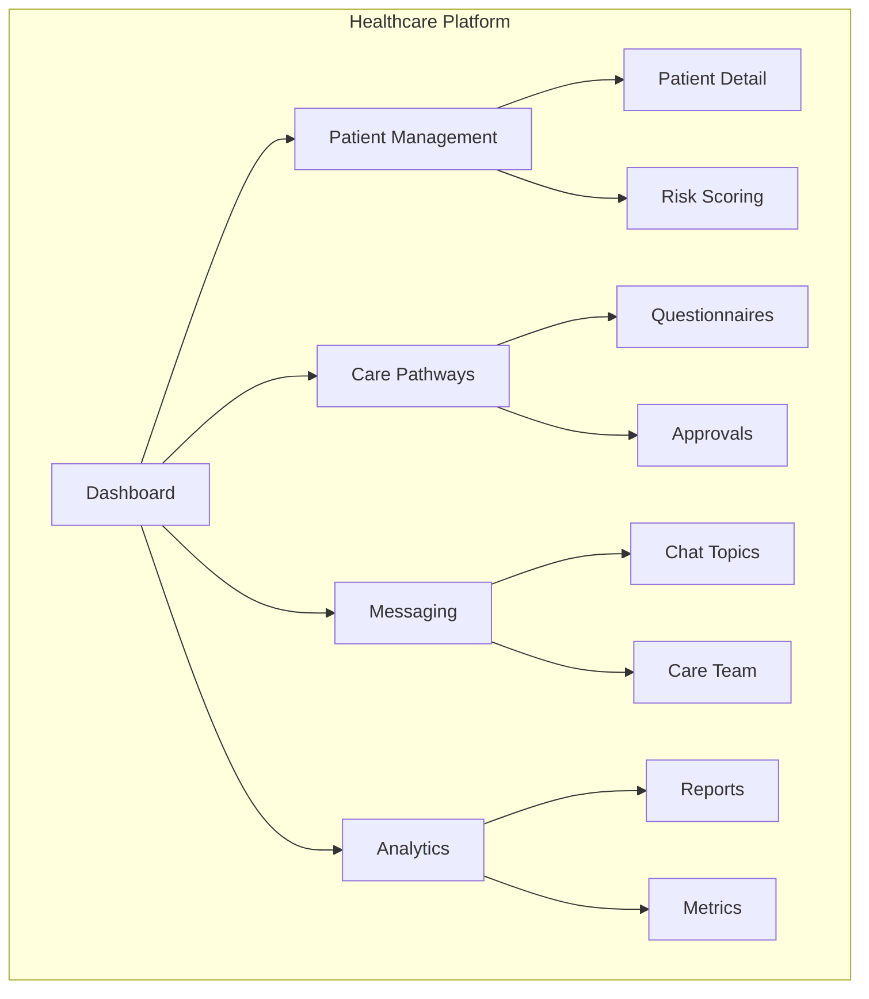

## Welcome

The Healthcare Patient Management Platform is a comprehensive solution designed to streamline patient care coordination, communication, and monitoring for healthcare organizations.

<CardGroup cols={2}>
  <Card
    title="Design Specifications"
    icon="palette"
    href="/design-specs"
  >
    Explore detailed specifications for all views and features
  </Card>
  <Card
    title="API Reference"
    icon="code"
    href="/api/API_INTEGRATION_GUIDE"
  >
    Integrate with our REST and GraphQL APIs
  </Card>
  <Card
    title="Architecture"
    icon="building"
    href="/architecture/BACKEND_ARCHITECTURE"
  >
    Understand the system architecture and design decisions
  </Card>
  <Card
    title="Quick Start"
    icon="rocket"
    href="/quickstart"
  >
    Get up and running in minutes
  </Card>
</CardGroup>

## Key Features

<AccordionGroup>
  <Accordion title="Patient Management" icon="users">
    Comprehensive patient profiles with care pathway tracking, risk scoring, and health observations. Manage patient demographics, appointments, medications, and tasks from a unified interface.
  </Accordion>
  <Accordion title="Care Coordination" icon="heart-pulse">
    Structured care pathways guide patients through treatment protocols. Track progress, manage questionnaires, and ensure timely interventions with predictive analytics.
  </Accordion>
  <Accordion title="Team Collaboration" icon="people-group">
    Real-time team status, task management, shift scheduling, and internal messaging. Coordinate care across providers, nurses, and specialists.
  </Accordion>
  <Accordion title="Secure Messaging" icon="comments">
    HIPAA-compliant messaging between providers and patients. Organized chat topics, file attachments, and read receipts.
  </Accordion>
  <Accordion title="Risk Analytics" icon="chart-line">
    AI-powered risk scoring with predictive alerts. Identify at-risk patients before deterioration with configurable thresholds and factor weighting.
  </Accordion>
  <Accordion title="Patient Portal" icon="mobile">
    Self-service portal for patients to complete forms, view appointments, track medications, and communicate with their care team.
  </Accordion>
</AccordionGroup>

## Platform Overview

## Technology Stack

| Layer | Technology |
|-------|------------|
| Frontend | Angular 19+, Tailwind CSS |
| State Management | RxJS Services |
| API | REST, GraphQL |
| Authentication | OAuth 2.0, JWT |
| Database | PostgreSQL |
| Real-time | WebSockets |

## Getting Help

<CardGroup cols={2}>
  <Card
    title="Community"
    icon="slack"
    href="https://community.example.com"
  >
    Join our community for discussions and support
  </Card>
  <Card
    title="GitHub"
    icon="github"
    href="https://github.com/example/healthcare-platform"
  >
    Report issues and contribute to the project
  </Card>
</CardGroup>
